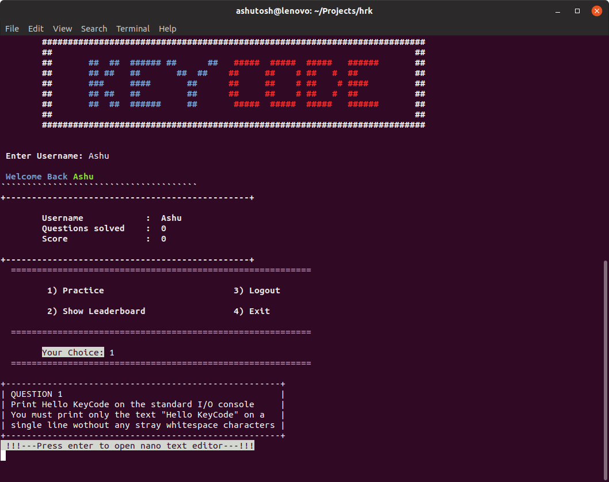

# keycode

A program in C that can help you to practice coding :sunglasses:

## What we built

We've buit a C program which replicates an enivironment similar to popular online code practising websites like [Hackerrank](https://www.hackerrank.com) and [Code Chef](https://www.codechef.com). Just like these websites, this program provides basic functionalities like compiling your code, code submission, leaderboard, experience level batches, keeping track of number of questions solved. The programs makes fairly extensive use of files and system commands.

## Why was it built

This project was made as part of the end of the semester project submission for IT 161. :sweat_smile:

Our Team consisted of three members :sunglasses:

- [Ashutosh Singh](https://github.com/ashutoshsingh05)
- [Darshan Patel](https://github.com/darshanpatel44)
- [Harsh Kakani](https://github.com/hkmartian)

## How to use

Just clone this repository using `git clone https://github.com/ashutoshsingh05/keycode.git`

Change directory using `cd keycode`

Make sure that all the files are in the same directory and execute the command below
```
gcc keycode.c -o keycode.out && ./keycode.out
```
## Screenshots



## Credits

- For the awesome idea and making an impressive UI: [Darshan Patel](https://github.com/darshanpatel44)
- Coding and logic development: [Ashutosh Singh](https://github.com/ashutoshsingh05)
- Provided sample Q & A with solutions: [Harsh Kakani](https://github.com/hkmartian)

**Liked the project? Don't forget to give us a :star:**